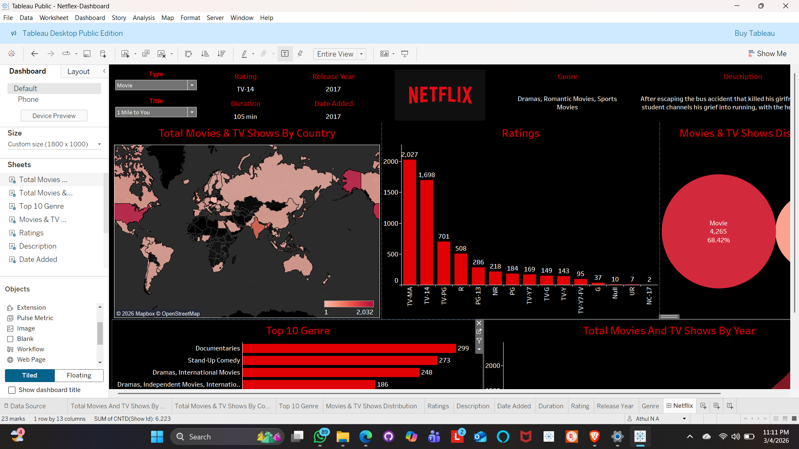

# Netflix Tableau Dashboard

## Project Overview

This project analyzes Netflix Movies and TV Shows using Tableau.
The dashboard provides insights into content distribution, ratings, genres, and release trends across the Netflix platform.

The goal of this project is to demonstrate **data visualization, dashboard design, and exploratory data analysis using Tableau**.

---

## Interactive Dashboard

View the interactive dashboard here:

https://public.tableau.com/views/Netflex-Dashboard/Netflix

---

## Dashboard Preview

### Main Dashboard

### Tableau Workspace

---

## Dashboard Features

• Total Movies and TV Shows by Country (Map)
• Ratings Distribution Analysis
• Movies vs TV Shows Comparison
• Top 10 Genres on Netflix
• Content Added by Year
• Interactive filters for Title and Type

---

## Tools Used

Tableau Public
Data Visualization
Data Cleaning
CSV Dataset

---

## Dataset

Netflix Movies and TV Shows Dataset

Source: Netflix titles dataset containing information about movies and TV shows including release year, rating, genre, country, and date added.

---

## Key Insights

• Most Netflix content consists of **Movies (~68%)** compared to TV Shows
• **TV-MA and TV-14** are the most common content ratings
• **Documentary and Stand-Up Comedy** are among the most frequent genres
• Netflix significantly increased content additions **after 2016**

---

## Project Structure

Netflix-Tableau-Dashboard
│
├── Netflix_Dashboard.twbx
├── netflix_titles.csv
├── dashboard.png
├── tableau-workspace.png
└── README.md

---

## Author

Athul Ajithan
athulajithan039@gmail.com

