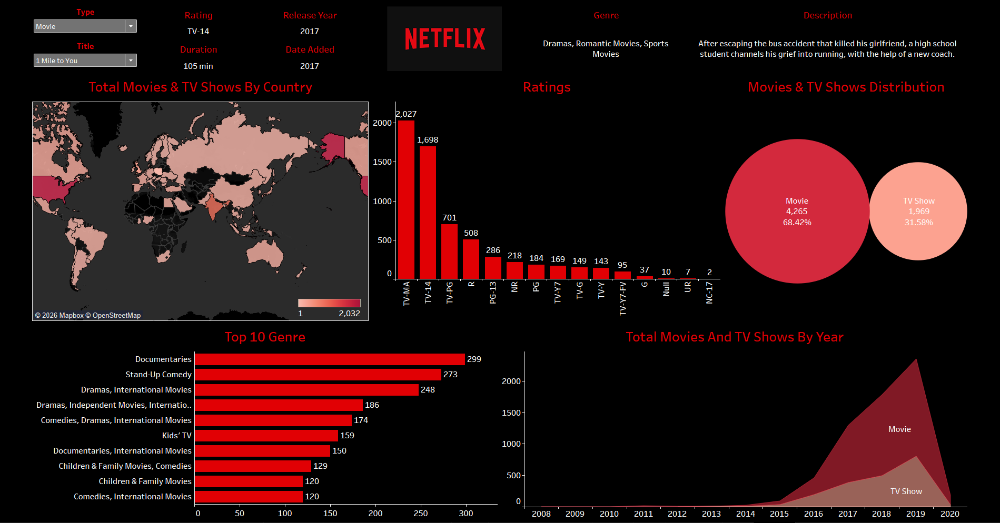

# Netflix Tableau Dashboard

## Project Overview
This project analyzes Netflix Movies and TV Shows using Tableau.  
The dashboard provides insights into content distribution, ratings, genres, and release trends.

## Dashboard Features

• Total Movies and TV Shows by Country (Map)
• Ratings Distribution
• Movies vs TV Shows Comparison
• Top 10 Genres
• Content Added by Year
• Interactive filters for title and type

Interactive Dashboard:
https://public.tableau.com/views/Netflex-Dashboard/Netflix

## Tools Used

Tableau Public  
Data Visualization  
Data Cleaning  
CSV Dataset

## Dataset
Netflix Movies and TV Shows Dataset

## Dashboard Preview

## Insights

• Most Netflix content is Movies (~68%)
• TV-MA and TV-14 ratings dominate the platform
• Documentary and Stand-Up Comedy are highly represented genres
• Content additions increased significantly after 2016
